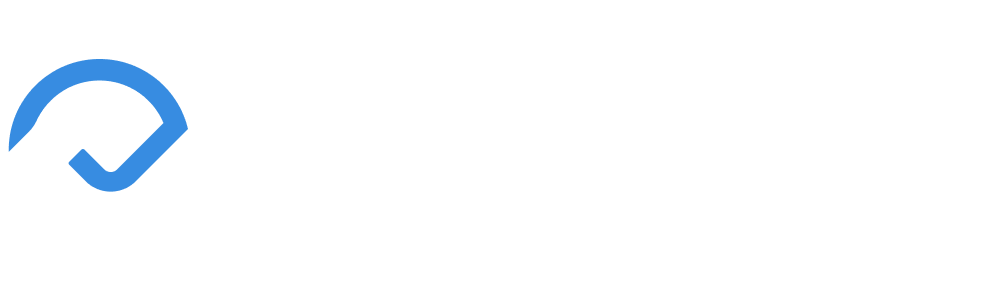

Since **October 15, 2022** — after seeing many popular YouTubers and random tech bros having these *impressive personal websites*—I've dedicated myself to building my own. After **256+ commits**, 650 intermediate days of work, and *thousands of hours* of research, prototyping, building, and debugging, [ncp.dev](https://www.ncp.dev/) is officially released for all public viewing as of, **July 26, 2024**. 

The reason it took me so long was my **indecisiveness** about *myself* and *the users* that this website would be presented to. At first, it took a portfolio perspective, but later changed to more of a **personal website** than anything. Nonetheless, I was dedicated to a perfect first release, and [`KingPr0o7.github.io`](https://github.com/KingPr0o7/KingPr0o7.github.io) didn't live up to that standard. From there, I've improved and learned so many more things. Like e-mail communications, Astro, MDX, Vercel, and much better CSS and JS conceptual knowledge. 

Which brings us to today, where I've also built my own [personal brand](https://www.ncp.dev/branding), for the website and any other application or experience I make. I hope you enjoy my website, and if you do, please [let me know](https://www.ncp.dev/contact) or share to the word on social media. Hopefully, one day, I can see a YouTube video, tweet, blog, or podcast about how my website inspired or awed someone!

# Trademark Notice
The Nathan Parker Brand, with my **logo** and **pictogram**, is currently **pending trademark** (™). Although they're not *registered*, you **shouldn't** *without* my written permission. You cannot pretend to be Nathan Parker (*by using my logo or pictogram*) or use my logo for your business, application, product, offering, project, social media account(s), or website(s) of any kind. Upon forking my repository, **please remove any of my logos and standalone pictograms** if published to your domain or any service provider. If you need more exact implications and usages pertaining to my brand, you can view the [usage guidelines](https://www.ncp.dev/branding#logo-or-pictogram-usage) on the [branding page](https://www.ncp.dev/branding). 

# Capabilities 
🏎️ Any page loads in ~0.31s on average (dependent on internet speed)

💪 100% Lighthouse performance score for every page

📨 Email communications with Resend

💻 Fits almost any screen size

📝 Easy MDX blog entries

🧭 Lively navigation bar

# Installation

1. Clone the repository (zip or SSH)
2. Unzip and get into the main directory (`portfolio-main/portfolio-main`)
3. Install [Node.js](https://nodejs.org/en)
4. Install [NPM](https://docs.npmjs.com/downloading-and-installing-node-js-and-npm) (`npm install -g npm`)
5. Install [Astro](https://docs.astro.build/en/install-and-setup/#manual-setup) (`npm install astro`)
6. Run Development Server (`npm run dev`)!

# Usage
- For **security reasons**, you won't have access to any environmental variables, which makes the contact page (email communications) **unlinked** with Resend. 

- Don't copy my site 1:1 — try to create something new and unique for you!

- **Please remove any of my logos and standalone pictograms** if published to your domain or any service provider.

- If you do end up using my contact logic, **make sure to change all emails to your own**.

**Other than that**, you are welcome to analyze, debug, or improve any part of the codebase! 

# Credits 
All credits to all service providers, Astro libraries, notable contributors, and GitHub sponsors are listed in the [credits page](https://www.ncp.dev/credits)!

# License
This repository is licensed under the **Apache License 2.0**. You can view the license [here](LICENSE).

